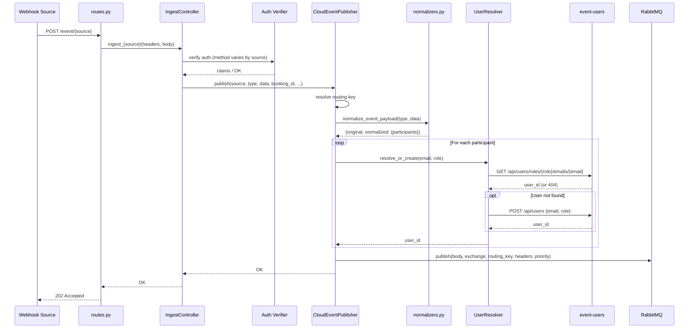

# event-receiver API Contracts

## HTTP Endpoints

All ingest endpoints are registered in `event_receiver/routes.py:15-81`. Each endpoint accepts both GET (returns `{"status": "ok"}` for webhook verification) and POST (processes the event).

---

### POST /event/booking

**Source**: `routes.py:15-19`, controller: `controllers/ingest.py:88-145`

**Authentication**: Static API key in `Authorization` header. Compared against `Settings.booking_api_key` (`config.py:125`).

**Request**:
- Content-Type: CloudEvents binary format (headers + JSON body)
- Required CloudEvent headers: `ce-type`, `ce-source`, `ce-id`, `ce-time`, `ce-specversion`
- Body (JSON):
  - `booking_uid` (str, **required**): Booking identifier, extracted from a copy of the payload before publish
  - For `booking.created` type, body must contain:
    - `users` (list): Array of `{role: "organizer"|"client", email: str}` objects
    - `start_time` (str): Booking start time
    - `end_time` (str): Booking end time
  - For other booking types: arbitrary JSON payload passed through

**Response**:
- `202 Accepted`: Event accepted and published
- `200 OK` (GET only): `{"status": "ok"}`

**Error Codes**:
- `400 Bad Request`: Invalid payload, missing `booking_uid`, schema validation failure for `booking.created`
- `401 Unauthorized`: Invalid API key
- `500 Internal Server Error`: Unexpected error

---

### POST /event/jitsi

**Source**: `routes.py:15-19`, controller: `controllers/ingest.py:43-86`

**Authentication**: JWT in `Authorization` header. Two-phase verification:
1. Full signature verification via `AuthorizationJWTVerifier.verify_signature()` (algorithm, issuer, audience validated) — returns parsed claims — `security.py:29-42`
2. Claims verification via `AuthorizationJWTVerifier.verify()` (checks `source` and `type` claims match the CloudEvent fields; receives pre-parsed claims, no second decode) — `security.py:49-94`

**Request**:
- Content-Type: CloudEvents binary format (headers + JSON body)
- Required CloudEvent headers: `ce-type`, `ce-source`, `ce-id`, `ce-time`, `ce-specversion`
- Required HTTP headers: `Authorization` (JWT token)
- Body (JSON): Jitsi event payload (arbitrary structure, merged with JWT claims on publish)

**Response**:
- `202 Accepted`: Event accepted and published
- `200 OK` (GET only): `{"status": "ok"}`

**Error Codes**:
- `400 Bad Request`: Invalid CloudEvent payload or headers
- `401 Unauthorized`: Invalid/expired JWT, claim mismatch (source/type)
- `500 Internal Server Error`: Unexpected error

---

### POST /event/unisender-go

**Source**: `routes.py:15-19`, controller: `controllers/ingest.py:162-194`

**Authentication**: MD5 HMAC signature embedded in the request body `auth` field. The service replaces the `auth` field with `Settings.email_api_key`, computes MD5 of the entire body, and compares via `hmac.compare_digest` -- `controllers/ingest.py:221-233`.

**Request**:
- Content-Type: `application/json`
- Body (JSON):
  - `auth` (str, **required**): MD5 signature for validation
  - `events_by_user` (list): Array of user event groups
    - `events` (list): Array of event objects
      - `event_data.metadata.booking_uid` (str): Extracted (popped) as booking identifier
      - Remaining `event_data` passed as CloudEvent payload

**Response**:
- `202 Accepted`: All events in batch accepted and published
- `200 OK` (GET only): `{"status": "ok"}`

**Error Codes**:
- `400 Bad Request`: Empty body, non-UTF-8 body, missing `auth` field
- `401 Unauthorized`: Invalid signature
- `500 Internal Server Error`: Configuration error (invalid API key setup) or unexpected error

**Note**: Publishes one CloudEvent per event in the `events_by_user[].events[]` array. Each event is published with a generated `event_id` (UUID) and `event_time` (current UTC timestamp).

---

### POST /event/getstream

**Source**: `routes.py:15-19`, controller: `controllers/ingest.py:196-215`

**Authentication**: GetStream webhook signature in `X-SIGNATURE` header. Absence of the header raises `UnauthorizedError` (HTTP 401) before any further processing. Signature verified via `StreamChat.verify_webhook(body, signature)` using `Settings.getstream_api_key` and `Settings.getstream_api_secret` -- `controllers/ingest.py:200-206`.

**Request**:
- Content-Type: `application/json`
- Required HTTP headers: `X-SIGNATURE` (GetStream webhook signature; missing header returns 401)
- Body (JSON): GetStream webhook payload
  - `type` (str): GetStream event type (used as suffix in CloudEvent type: `getstream.{type}`)
  - `channel_id` (str, optional): Used as `booking_id`
  - Full payload passed as CloudEvent data

**Response**:
- `202 Accepted`: Event accepted and published
- `200 OK` (GET only): `{"status": "ok"}`

**Error Codes**:
- `401 Unauthorized`: Missing `X-SIGNATURE` header, invalid signature
- `500 Internal Server Error`: Unexpected error

---

### GET /health

**Source**: `routes.py:84-87`

**Authentication**: None

**Response**: `200 OK`
```json
{"status": "ok"}
```

---

## RabbitMQ Messages Published

All messages are published via `CloudEventPublisher.publish()` in `adapters/publisher.py:37-133`.

### Exchange Configuration

- **Exchange name**: Value of `Settings.rabbit_exchange` (default: `"events"`)
- **Exchange type**: `topic` (durable)
- **Dead Letter Exchange**: `events.dlx` (topic, durable) -- declared by `RabbitTopologyManager`
- **Message format**: CloudEvents binary mode (headers contain CE attributes, body is JSON payload)

### CloudEvent Attributes (Message Headers)

Every published message includes these CloudEvent attributes as AMQP headers (`adapters/publisher.py:93-110`):

| Attribute | Source | Description |
|---|---|---|
| `type` | Event type string | e.g., `booking.created`, `getstream.message.new` |
| `source` | Source identifier | e.g., `booking`, `jitsi`, `unisender-go`, `getstream` |
| `id` | From incoming event or auto-generated | CloudEvent ID |
| `time` | From incoming event (if provided) | ISO 8601 timestamp |
| `booking_id` | Extracted per endpoint (if present) | Booking UID (CE extension); only set when a booking_id is available for the event |
| `traceid` | From request headers or generated UUID | Distributed trace ID |
| `spanid` | Generated UUID | Span ID for this publish operation |
| `idempotencykey` | SHA256 of type+booking_id+data | Deterministic dedup key |
| `dataschema` | Derived from type + schema version | e.g., `https://schemas.example.com/booking.created/v1` |
| `datacontenttype` | Always `application/json` | |
| `publisherservice` | Always `event-receiver` | |
| `publisherversion` | Always `0.1.0` | |

### Message Body Structure

All messages have a normalized body structure (`normalizers.py:26-50`):

```json
{
  "original": { /* raw payload as received */ },
  "normalized": {
    "participants": [
      {"email": "user@example.com", "role": "organizer", "user_id": "uuid-from-event-users"}
    ]
  }
}
```

### Routing Rules and Destinations

Routing is first-match based on glob patterns (`routing.py:43-65`, rules in `config.py:7-94`):

| Routing Key (Queue) | Source Pattern | Type Pattern | Priority | CloudEvent Type |
|---|---|---|---|---|
| `events.booking.lifecycle` | `booking` | `booking.created` | 10 (CRITICAL) | `booking.created` |
| `events.booking.lifecycle` | `booking` | `booking.rescheduled` | 10 (CRITICAL) | `booking.rescheduled` |
| `events.booking.lifecycle` | `booking` | `booking.reassigned` | 10 (CRITICAL) | `booking.reassigned` |
| `events.booking.lifecycle` | `booking` | `booking.cancelled` | 10 (CRITICAL) | `booking.cancelled` |
| `events.booking.reminder` | `booking` | `booking.reminder_sent` | 7 (HIGH) | `booking.reminder_sent` |
| `events.chat.lifecycle` | `booking` | `chat.created` | 5 (NORMAL) | `chat.created` |
| `events.chat.lifecycle` | `booking` | `chat.deleted` | 5 (NORMAL) | `chat.deleted` |
| `events.chat.activity` | `booking` | `chat.message_sent` | 5 (NORMAL) | `chat.message_sent` |
| `events.meeting.lifecycle` | `booking` | `meeting.url_created` | 5 (NORMAL) | `meeting.url_created` |
| `events.meeting.lifecycle` | `booking` | `meeting.url_deleted` | 5 (NORMAL) | `meeting.url_deleted` |
| `events.notification.commands` | `*` | `notification.send_requested` | 7 (HIGH) | `notification.send_requested` |
| `events.notification.delivery` | `*` | `notification.email.message_sent` | 7 (HIGH) | `notification.email.message_sent` |
| `events.notification.delivery` | `*` | `notification.telegram.message_sent` | 7 (HIGH) | `notification.telegram.message_sent` |
| `events.notification.delivery` | `*` | `notification.push.message_sent` | 7 (HIGH) | `notification.push.message_sent` |
| `events.jitsi` | `jitsi*` | `*` | 5 (NORMAL) | Any Jitsi type |
| `events.mail` | `unisender-go` | `unisender.*` | 5 (NORMAL) | `unisender.status_created` |
| `events.chat` | `getstream` | `getstream.*` | 5 (NORMAL) | `getstream.{type}` |
| `events.unrouted` (fallback) | -- | -- | 5 (NORMAL) | Any unmatched event |

Source: `config.py:7-94`, priorities from `event_schemas.types.EVENT_PRIORITIES`

### Queue Topology (Declared on Startup)

Each queue in `Settings.topology_queues` (derived from routing destinations) gets:
- Main queue: durable, `x-max-priority: 10`, dead-letter to `events.dlx` with routing key `{queue}.dlq`
- DLQ: `{queue}.dlq`, durable, `x-message-ttl: 86400000` (24 hours)

Source: `adapters/publisher.py:148-204`

### Request/Response Flow Diagram


